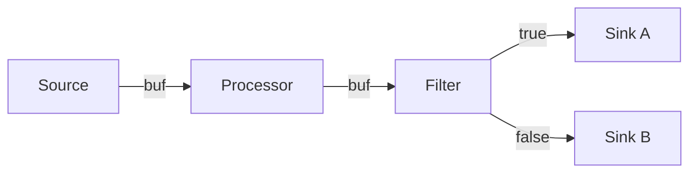

# ZStreamer

A streaming pipeline framework for [Zephyr RTOS](https://zephyrproject.org/), inspired by [GStreamer](https://gstreamer.freedesktop.org/).
Define data pipelines entirely in devicetree — wire nodes with phandles, and data flows automatically through shared `net_buf` pools. No application code required.

## How it works



Every node is a Zephyr device with its own **thread** and **k_fifo** input queue. A `streaming-graph` container owns a single `net_buf_pool` shared by all its nodes. Sources allocate buffers from the pool, fill them via a `process` callback, and distribute to children by putting refs into their FIFOs. Each downstream thread blocks on its FIFO, processes the buffer, and either forwards to its own children or unrefs it (sinks). Distribution uses copy-on-write: readonly children share a `net_buf_ref`, readwrite children get a `net_buf_clone`. When the last consumer unrefs, the buffer returns to the pool.

**Four node types:**

| Type | What it does | Example |
|------|-------------|---------|
| **Source** | Produces buffers, start/stop via semaphores | `uart_src`, `spi_src`, `adc_src` |
| **Processor** | Transforms buffers in-place, forwards to children | `passthrough_node` |
| **Filter** | Routes to `children` (returns 1) or `false-children` (returns 0) | `odd_filter` |
| **Sink** | Terminal consumer, unrefs buffers (no children allowed) | `fs_sink`, `pwm_sink`, `uart_sink` |

## Example: DTS pipeline

```dts
/ {
    streaming-graph {
        compatible = "zstreamer,graph";
        pool-count = <16>;
        pool-size = <128>;

        spi_source: spi-source {
            compatible = "zstreamer,spi-src";
            spi-dev = <&spi1>;
            autostart;
            children = <&spi_sink>;
        };

        spi_sink: spi-sink {
            compatible = "zstreamer,spi-sink";
            spi-dev = <&spi2>;
        };
    };
};
```

That's it. SPI data flows from `spi1` to `spi2` at boot. No C code needed.

## Included drivers

| Driver | Type | Compatible |
|--------|------|-----------|
| UART source/sink | Source, Sink | `zstreamer,uart-src` / `zstreamer,uart-sink` |
| SPI source/sink | Source, Sink | `zstreamer,spi-src` / `zstreamer,spi-sink` |
| ADC source | Source | `zstreamer,adc-src` |
| FS sink | Sink | `zstreamer,fs-sink` |
| PWM sink | Sink | `zstreamer,pwm-sink` |

## Writing a driver

Every driver follows the same pattern:

```c
#define DT_DRV_COMPAT zstreamer_my_sink
#include <zstreamer/sink.h>

static int my_sink_process(const struct device *dev, struct net_buf *buf) {
    /* consume buf */
    return 0;
}

static const struct zstreamer_node_driver_api my_sink_api = {
    .process = my_sink_process,
};

#define MY_SINK_DEFINE(inst)                                          \
  ZSTREAMER_SINK_DT_INST_PRE_DEFINE(inst);                            \
  static struct zstreamer_sink_data my_sink_data_##inst =             \
      ZSTREAMER_SINK_DATA_INIT(inst);                                \
  static const struct zstreamer_sink_config my_sink_config_##inst =   \
      ZSTREAMER_SINK_CONFIG_INIT(inst);                              \
  DEVICE_DT_INST_DEFINE(inst, zstreamer_node_common_init, NULL,       \
                        &my_sink_data_##inst, &my_sink_config_##inst,  \
                        POST_KERNEL, CONFIG_KERNEL_INIT_PRIORITY_DEVICE, \
                        &my_sink_api);

DT_INST_FOREACH_STATUS_OKAY(MY_SINK_DEFINE)
```

Key rules:
- Call `PRE_DEFINE(inst)` **before** data/config structs
- Source drivers use `zstreamer_source_common_init` (not `zstreamer_node_common_init`)
- Sources support `autostart` DTS property for boot-time start
- For custom init, call `common_init` last (it starts the node thread)

## Samples

| Sample | Pipeline |
|--------|----------|
| `uart2uart` | UART RX -> UART TX |
| `spi2spi` | SPI RX -> SPI TX |
| `adc2fakesink` | ADC capture -> log output |
| `sine2pwm` | Sine wave -> PWM (LED) duty cycle |
| `numgen2fakesink` | Number generator -> log output |

## Building & testing

```sh
# Run all tests across all suites
west twister -T tests -p native_sim --inline-logs

# Build a single test
west build -b native_sim -d build/test-node tests/subsys/node -p auto
timeout 120s ./build/test-node/zephyr/zephyr.exe

# Build a sample for hardware
west build -b nucleo_u575zi_q samples/uart2uart
```

## Roadmap

- [x] **UART source/sink** — serial data streaming
- [x] **SPI source/sink** — SPI bus data relay
- [x] **ADC source** — analog-to-digital capture
- [x] **FS sink** — write pipeline data to filesystem
- [x] **PWM sink** — drive PWM duty cycle from pipeline data
- [ ] **I2S source/sink** — audio streaming (mic-to-speaker, recording, DSP)
- [ ] **BLE GATT sink/source** — wireless data over BLE notifications
- [ ] **Sensor source** — wraps Zephyr sensor API (works with hundreds of existing drivers)
- [ ] **USB CDC ACM** — USB serial streaming / data acquisition
- [ ] **CAN bus** — automotive/industrial logging
- [ ] **DAC sink** — analog output (`sine_src -> dac_sink` = function generator)
- [ ] **TCP/UDP sockets** — network telemetry
- [ ] **Threshold filter** — pass/block on configurable value
- [ ] **Chunker processor** — buffer size adaptation between protocols
- [ ] **Shell sink** — dump pipeline data to Zephyr shell for debugging

## Contact

Sharon Naim :maple_leaf: — sharonthecreator@gmail.com
